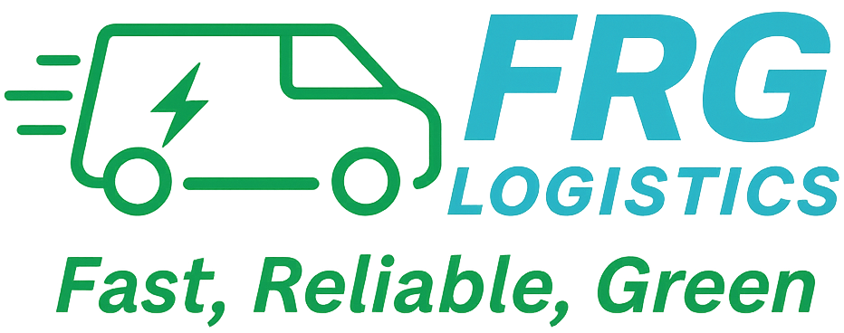
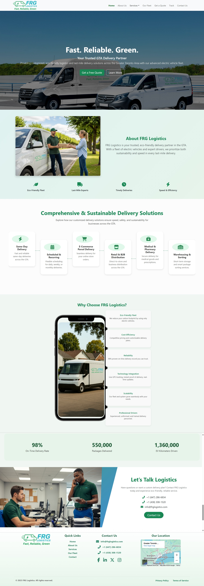

<div align="center">

  

  # **FRG Logistics – Official Website**

  ### *Efficient. Reliable. Green.*

   <p>
    
    
    
    
    
  </p>

</div>

## Table of Contents
- [Description](#description)
- [Features](#features)
- [Technologies & Implementation](#technologies--implementation)
- [Installation](#installation)
- [Usage](#usage)
- [Screenshot](#screenshot)
- [Contributions](#contributions)
- [Tests](#tests)
- [Contact Information](#contact-information)
- [License](#license)

## Description
The **FRG Logistics Official Website** is a modern, eco-friendly delivery platform built to provide **efficient, reliable, and sustainable logistics services** across the Greater Toronto Area.  

The website showcases the company’s services, fleet, and sustainability efforts while allowing users to:  
- Learn about FRG’s logistics solutions.  
- Request delivery quotes through an interactive **Get a Quote form**.  
- Track shipments in real-time with the **Tracking system**.  
- Reach out directly via a built-in **Contact Form** for inquiries and partnerships.  
- Explore eco-friendly initiatives and fleet technologies.  

This project emphasizes **professional branding, interactivity, and scalability** to support FRG Logistics’ mission of making deliveries greener.

## 🌐 Live Website
🔗 [Visit FRG Logistics](https://frglogistics.com)

## Features
- 🚚 **Delivery Services Overview** – Same-day, scheduled, recurring, and medical deliveries.  
- 📦 **Logistics & Warehousing** – Flexible solutions for businesses.  
- 🔋 **Eco-Friendly EV Fleet** – Showcases vehicle types and sustainability impact.  
- 💡 **Interactive Animations** – Built with Framer Motion and Lottie for engaging UI.  
- 📝 **Get a Quote Form** – Customers can request quotes easily.  
- 📍 **Track Deliveries** – Real-time package tracking functionality.  
- 📱 **Responsive Design** – Optimized for desktop and mobile.  

## Technologies & Implementation
| Technology                      | Purpose & Implementation                                                                                                                          |
| ------------------------------- | ------------------------------------------------------------------------------------------------------------------------------------------------- |
| **React (Vite)**                | Frontend framework for building fast, modern, and modular UI components. Vite was used as the bundler for quick development and optimized builds. |
| **Express.js**                  | Backend framework used to handle form submissions (`/contact`, `/quote`, `/track`) and provide secure API endpoints.                                        |
| **MongoDB**                     | NoSQL database for storing quote requests, contact form data, and tracking information.                                                           |
| **Bootstrap + React-Bootstrap** | UI framework for responsive grid layout, styled components, and mobile-first design.                                                              |
| **Font Awesome**                | Used for scalable vector icons across navigation, services, and feature sections.                                                                 |
| **Framer Motion**               | Animation library for smooth transitions, hover effects, and scroll-based animations, enhancing user experience.                                  |
| **Lottie-React**                | Integrated JSON-based vector animations for modern interactive visuals (lightweight and scalable).                                                |
| **CORS**                        | Configured in Express to securely allow requests between the frontend (React) and backend (API).                                                  |

## Installation
This repository is for demonstration and portfolio purposes.  
If you wish to run the project locally for review or learning:  

1. Clone the repo  
   ```bash
   git clone https://github.com/yourusername/FRG-LOGISTICS.git
   
2. Navigate to the client folder and install dependencies.
    ```bash
    cd client
    npm install

3. Navigate to the server folder and install dependencies.
   ```bash
   cd ../server
   npm install

4. Start both client and server.
   ```bash
   npm run dev   # in client
   npm start     # in server
#### Note: Production deployment is reserved for FRG Logistics only.

## Usage
Once the project is running locally or in production, users can:

- 🏠 **Navigate the Website** – Explore pages such as Home, About Us, Services, Our Fleet, Medical Delivery, and more.  
- 📝 **Request a Quote** – Use the interactive *Get a Quote* form to submit delivery requests.  
- 📍 **Track Shipments** – Enter tracking details to check the status of deliveries in real-time.  
- ✉️ **Contact FRG Logistics** – Send inquiries or partnership requests via the built-in Contact Form.  
- 📦 **Learn About Services** – Browse logistics solutions including same-day, recurring, medical, and warehousing services.  
- 🔋 **Explore EV Fleet** – Discover FRG’s eco-friendly, electric vehicle delivery operations.  

This project was built as the official company website for **FRG Logistics**.  
It is intended for demonstration and portfolio purposes only — **not for public reuse**.

## Screenshot


## Contributions
This project was developed as a commissioned website for **FRG Logistics**.  
As such, external contributions are **not being accepted**.  

If you’d like to discuss collaboration or have feedback, feel free to reach out through the contact information below.

## Tests
This project was manually tested for:
- Cross-browser compatibility (Chrome, Edge, Safari)  
- Mobile responsiveness (desktop, tablet, smartphone)  
- Form submissions (Track, Get a Quote & Contact form validation)  
- API integrations with backend (Express + MongoDB)  
- Deployment on production hosting environment  

## Contact Information
Developed by **Muniba Pervez**  

- 🌐 Portfolio: [https://github.com/MunibaP/React-Portfolio.git]  
- 💼 Github: [https://github.com/MunibaP]  
- 📧 Email: [munibapervez596@gmail.com]  

## License
This project is **proprietary** and was developed for **FRG Logistics** as their official website.  

- Source code and design are provided here **for portfolio and demonstration purposes only**.  
- Commercial use, redistribution, or modification without prior authorization is **strictly prohibited**.  
- All rights reserved © 2025 FRG Logistics & Muniba Pervez.
  
  


